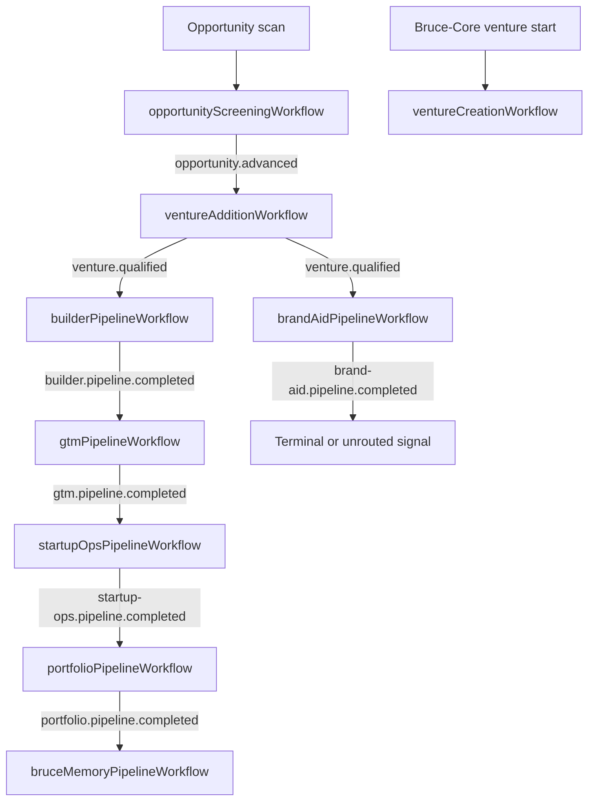

# Workflow Orchestration Matrix

## Executive Summary

Bruce orchestration is split between Temporal workflows for long-running module work and BullMQ events for cross-module progression. Opportunity and Add-Venture contain the richest multi-step workflows. Brand-Aid, Builder, GTM, Startup-Ops, Portfolio, and Bruce-Memory follow a thinner single-agent pipeline pattern. Bruce-Core has a separate venture lifecycle workflow that is mostly independent from the Opportunity-to-Add-Venture chain.

The main lifecycle is:

1. Opportunity screening emits `opportunity.advanced`.
2. Add-Venture consumes it and starts `ventureAdditionWorkflow`.
3. Add-Venture emits `venture.qualified`.
4. Brand-Aid and Builder start in parallel.
5. Builder completion drives GTM.
6. GTM drives Startup-Ops.
7. Startup-Ops drives Portfolio.
8. Portfolio drives Bruce-Memory.

Brand-Aid completion is not currently part of the durable continuation chain.

## Module Matrix

### Opportunity

- App path: `apps/opportunity`
- Task queue: `bruce-opportunity`
- Workflows: `opportunityScreeningWorkflow`, `quickOpportunityScanWorkflow`, `weeklyDiscoveryWorkflow`
- Start surfaces: `apps/opportunity/src/routes/scans.ts`, `apps/opportunity/src/services/scan.service.ts`
- Job/status surfaces: `apps/opportunity/src/routes/jobs.ts`, `apps/opportunity/src/routes/workflows.ts`
- Emits: `opportunity.advanced`
- Consumes: none through module event worker
- Notes: This is the most mature orchestration flow, with quality gates, retries, prioritization, persistence, observability steps, and scan-id fallback for workflow lookup.

### Add-Venture

- App path: `apps/add-venture`
- Task queue: `bruce-add-venture`
- Workflow: `ventureAdditionWorkflow`
- Start surfaces: `apps/add-venture/src/routes/structuring.ts`, `apps/add-venture/src/services/structuring.service.ts`
- Event start: `opportunity.advanced` through `apps/add-venture/src/services/inter-module-structuring.ts`
- Job/status surfaces: `apps/add-venture/src/routes/jobs.ts`, `apps/add-venture/src/routes/workflows.ts`
- Emits: `venture.qualified`
- Consumes: `opportunity.advanced`
- Notes: Long linear agent pipeline for briefing, venture volumes, critic, dossier composition, persistence, and event emission.

### Bruce-Core

- App path: `apps/bruce-core`
- Task queue: `bruce-bruce-core`
- Workflow: `ventureCreationWorkflow`
- Start surfaces: `apps/bruce-core/src/services/venture.service.ts`
- Job/status surfaces: `apps/bruce-core/src/routes/jobs.ts`, `apps/bruce-core/src/routes/workflows.ts`
- Emits: `bruce-core.venture.created` through the event bus
- Consumes: `opportunity.advanced` as a stub through module event worker
- Notes: Core venture lifecycle and module dispatch are modeled separately from the BullMQ pipeline chain.

### Brand-Aid

- App path: `apps/brand-aid`
- Task queue: `bruce-brand-aid`
- Workflow: `brandAidPipelineWorkflow`
- Start surfaces: `apps/brand-aid/src/routes/pipeline.ts`, `apps/brand-aid/src/services/pipeline.service.ts`
- Event start: `venture.qualified`
- Emits: `brand-aid.pipeline.completed`
- Consumes: `venture.qualified`
- Notes: Runs in parallel with Builder after venture qualification. Completion does not route to a downstream module by default.

### Builder

- App path: `apps/builder`
- Task queue: `bruce-builder`
- Workflow: `builderPipelineWorkflow`
- Start surfaces: `apps/builder/src/routes/pipeline.ts`, `apps/builder/src/services/pipeline.service.ts`
- Event start: `venture.qualified`
- Emits: `builder.pipeline.completed`
- Consumes: `venture.qualified`
- Notes: Builder is the branch that continues the durable chain into GTM.

### GTM

- App path: `apps/gtm`
- Task queue: `bruce-gtm`
- Workflow: `gtmPipelineWorkflow`
- Start surfaces: `apps/gtm/src/routes/pipeline.ts`, `apps/gtm/src/services/pipeline.service.ts`
- Event start: `builder.pipeline.completed`
- Emits: `gtm.pipeline.completed`
- Consumes: `builder.pipeline.completed`

### Startup-Ops

- App path: `apps/startup-ops`
- Task queue: `bruce-startup-ops`
- Workflow: `startupOpsPipelineWorkflow`
- Start surfaces: `apps/startup-ops/src/routes/pipeline.ts`, `apps/startup-ops/src/services/pipeline.service.ts`
- Event start: `gtm.pipeline.completed`
- Emits: `startup-ops.pipeline.completed`
- Consumes: `gtm.pipeline.completed`

### Portfolio

- App path: `apps/portfolio`
- Task queue: `bruce-portfolio`
- Workflow: `portfolioPipelineWorkflow`
- Start surfaces: `apps/portfolio/src/routes/pipeline.ts`, `apps/portfolio/src/services/pipeline.service.ts`
- Event start: `startup-ops.pipeline.completed`
- Emits: `portfolio.pipeline.completed`
- Consumes: `startup-ops.pipeline.completed`

### Bruce-Memory

- App path: `apps/bruce-memory`
- Task queue: `bruce-bruce-memory`
- Workflow: `bruceMemoryPipelineWorkflow`
- Start surfaces: `apps/bruce-memory/src/routes/pipeline.ts`, `apps/bruce-memory/src/services/pipeline.service.ts`
- Event start: `portfolio.pipeline.completed`
- Emits: `bruce-memory.pipeline.completed`
- Consumes: `portfolio.pipeline.completed`

## Lifecycle Diagram

## Findings

**Clear module isolation.** Each backend module owns its Temporal queue, worker, activities, service layer, and HTTP route surface.

**Cross-module orchestration is event-driven, not parent-child Temporal orchestration.** This keeps module ownership clean but makes saga state implicit across multiple workflows and queues.

**Opportunity and Add-Venture are richer than the downstream modules.** They include more explicit step state, quality gates, and handoff-specific logic. The later modules mostly wrap one agent and one completion event.

**Brand-Aid is a parallel branch with no durable join.** The route graph does not make Brand-Aid output a prerequisite for GTM.

**Workflow IDs, observability IDs, and event IDs are not a single global identifier.** Operators need to understand which ID belongs to Temporal, observability, dashboard routes, BullMQ, and domain records.

## Improvement Opportunities

- Define whether the lifecycle is a linear pipeline, a branching DAG, or a saga with joins.
- Add an orchestration registry that lists each module’s workflow, task queue, consumed events, emitted events, and start routes.
- Standardize job/status route behavior across modules.
- Promote the downstream single-agent pipeline pattern into an explicit reusable orchestration template or manifest.
- Add a durable join if GTM depends on both Builder and Brand-Aid.

## Recommended Next Checks

- Confirm every module listed here has its Temporal worker enabled in the target deployment.
- Validate all task queue names against `apps/*/src/temporal/config.ts`.
- Trace a live workflow from Opportunity to Bruce-Memory and capture Temporal IDs, observability run IDs, and event IDs.
- Decide whether Bruce-Core should become the lifecycle coordinator or remain a separate module.
